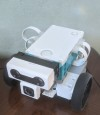

# LEGO Hub Toolkit API Design

This document serves as an overview of the toolkit API, describing the key classes used to build an application that communicates with the robot.   This description will remain at a high level.  See the docs in each python class for detailed API.

The architecture has two layers:
1. Client - provides application-level Remote Procedure Calls and asynchronous Events
2. Connection - provies connectivity via USB and Bluetooth

Events are propagated using https://events.readthedocs.io/en/latest/.

An application will be mostly concerned with the Client layer.

## Client Layer

This is the layer directly used by applications that wish to communicate with the robot.  Typically, the application will instantiate one HubClient and one HubMonitor, and then use those to manipulate the hub state.

````python
client = HubClient()
monitor = HubMonitor(client)
client.start() # start connection to monitor the hub
# the hub monitor will be updated to reflect current hub state
````

### HubClient

This class is the main application-level interface to the hub.  After construction, call the function `start` to begin monitoring the hub.
````python
client = HubClient()
client.start()
````
At this point, the client will begin monitoring USB and/or Bluetooth for the hub.  Once detected, it will connect and begin monitoring the hub state.  

The hubclient will operate in one of the following states:
* DISCONNECTED: Initial state; no connection to hub
* CONNECTING:  Attempting to connect to the hub
* TELEMETRY: Hub is sending its status regularly

The client maintains its connection state in property `state`, and will raise event `connection_state_changed` on each change.

This class provides a function call and event interface to the hub.  Functions are available to start and stop programs on the hub, for example.  Each function call will block until the hub response is received.

````python
client.program_execute(3) # start program in slot 3
...
client.program_terminate() # stop running program
````

### HubMonitor

This class is used to decode the messages received from the hub (via the client) and maintain the hub state.  To instantiate, provide a HubClient; the monitor will subscribe to the appropriate client events and maintain the state automatically.
````python
client = HubClient()
monitor = HubMonitor(client)
client.start()
...
# Hub state available in monitor.state
````

### HubLogger

This class provides infastructure to log telemetry data to a file.  Two example classes are provided:
* BasicHubLogger logs a line of output (configurable) a single CSV file on each telemetry update
* ProgramHubLogger log will separate the output to one file per program

The user can customize the data to log in either of these classes, or can write a subclass to customize the logging; e.g. if an alternate format is desired.

## Connection Layer

This layer provides the mechanism that HubClient uses to communicate with the hub.  

Typically, the connection will be specified by run-time configuration as described in the README.  If you wish to bypass the runtime configuration, create a ConnectionMonitor and pass it into the HubClient constructor.

### ConnectionMonitor

The connection monitor is responsible for monitoring a type of connection -- either USB or Bluetooth -- for the hub.  When the hub is discovered, the connection monitor raises an event.  Similarly, an event is raised if the hub is disconnected.

There are three concrete implementations of the ConnectionMonitor that support hub connect/disconnect and power cycling:
* UsbConnectionMonitor - monitors USB bus
* BluetoothConnectionMonitor - monitors Bluetooth
* MultiplexedConnectionMonitor - monitors both USB and Bluetooth

Additionally, for the case that you do not desire the monitoring capability (or the code does not work on your platform), the DirectConnectionMonitor can be used to provide a ConnectionMonitor wrapper around a simple connection, e.g. a serial port.  This implementation does not handle hub disconnect/re-connect.  It is useful for a simple one-shot application and for platforms that don't have an implementation of the above USB or Bluetooth connection monitors.

Application code will normally only instantiate one of the ConnectionMonitor objects in order to pass into the HubClient initializer.  For example:

````python
client = HubClient(UsbConnectionMonitor())
client.start()
````
If not specified, HubClient will use a Multiplexed connection monitor.

### Connection

An abstraction of an i/o port used to send/receive data from the hub.  It is an abstract base class inherited by SerialConnection and BluetoothConnection.

Application code will normally only instantiate one of these classes to use with a DirectConnectionMonitor when a specific device is desired.  For example:
````python
cm = DirectConnectionMonitor(SerialConnection("/dev/ttyACM0"))
client = HubClient(cm)
client.start()
````
